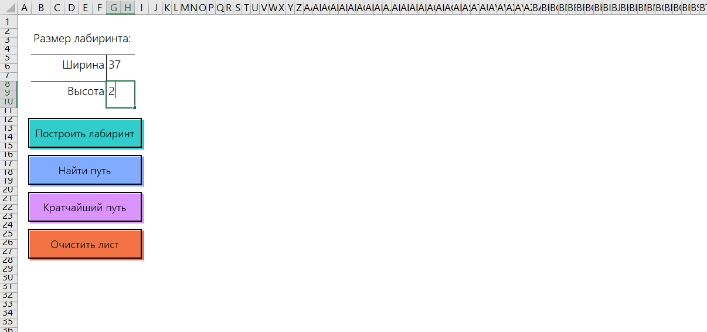

Программа генерирует лабиринт на листе Excel и находит в путь в этом лабиринте бэктрекингом.  
Дополнительно реализован поиск кратчайшего пути алгоритмом Флойда-Уоршелла. Он работает медленно и в силу выбора метода генерации лабиринта часто совпадает с путём, найденным бэктрекингом.  

При открытии книги запускается макрос, который очищает нужные области листа и оставляет курсор на ячейке для ввода ширины лабиринта.  
Если прохождение лабиринта невозможно, сообщение об этом появится в объединённой ячейке B30:H33.  

