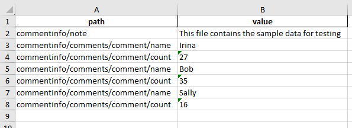

Программа получает последовательности тэгов для содержимого xml-файла.

Например, из такого xml-файла:
```xml
<commentinfo>
	<note>This file contains the sample data for testing</note>
	<comments>
		<comment>
			<name>Irina</name>
			<count>27</count>
		</comment>
		<comment>
			<name>Bob</name>
			<count>35</count>
		</comment>
		<comment>
			<name>Sally</name>
			<count>16</count>
		</comment>
	</comments>
</commentinfo>
```
получится такой xlsx-файл:


